# 某大学幼儿园报名缴费系统 需求规格说明书

---

## 一、文档信息

| 项目 | 内容 |
|------|------|
| 文档编号 | KGS-SRS-20260507 |
| 文档版本 | v2.6 |
| 文档状态 | 评审中 |
| 创建日期 | 2026-05-07 |
| 最后更新 | 2026-05-07 |
| 编写人 | 需求官 |
| 审核人 | [待填写] |
| 批准人 | [待填写] |

### 版本历史

| 版本 | 日期 | 修改内容 | 修改人 |
|------|------|---------|--------|
| v1.0 | 2026-05-07 | 初稿 | 需求官 |
| v1.1 | 2026-05-07 | 需求审查后修复 | 需求官 |
| v2.0 | 2026-05-07 | 重大需求变更：新增退款/消息/档案/配置/对接模块，费用改为按班级预设，系统架构升级 | 需求官 |
| v2.1 | 2026-05-07 | 需求审查修复：补充 5 个流程图 + 3 个异常场景表 + 3 个字段/筛选表 | 需求官 |
| v2.5 | 2026-05-07 | 新增操作日志功能：报名全链路操作记录（保存草稿/提交/修改/审核通过/审核驳回），园长端详情页时间线展示 | 需求官 |
| v2.6 | 2026-05-07 | 新增「学生缴费管理」模块：学期级账单生成/修改金额/应收实收概览/催缴/导出，报名审核剥离账单生成逻辑 | 需求官 |
| v2.5 | 2026-05-07 | 新增操作日志功能：报名全链路操作记录（保存草稿/提交/修改/审核通过/审核驳回），园长端详情页时间线展示 | 需求官 |

---

## 二、项目概述

### 2.1 项目背景

当前幼儿园使用旧 PC 端报名系统，流程为：家长 PC 端填信息上传附件 → 园长审核 → 手动设定费用生成收款二维码 → 家长扫码录入身份信息支付 → 人工开票。存在以下痛点：

- **系统割裂**：报名、支付、开票各环节独立，数据不互通
- **费用设置低效**：园长逐人手动设置保育费和伙食费金额，工作量大且易出错
- **无退款机制**：退费场景缺乏系统支持，依赖线下处理
- **无消息通知**：家长需主动查询报名进度，体验差
- **无标准化配置**：费用无班级标准，无法按规则自动生成账单

为从根本上解决上述问题，建设全新的幼儿园报名缴费系统——家长 H5 端嵌入苏大 APP，园长 PC 端管理后台，深度对接教职工系统、支付系统、财务系统、消息体系。

### 2.2 项目建设目标

1. 家长通过苏大 APP H5 端完成子女绑定、入学报名、在线缴费、在线开票、退款查看全流程，无需 PC 或线下操作
2. 对接教职工系统，实现教职工及子女信息自动同步，减少重复填写
3. 费用按班级（小班/中班/大班）预设标准，审核通过后自动生成账单，消除逐人手动设置
4. 对接财务系统实现支付后自动开票和线上退款，全链路财务数据打通
5. 园长通过 PC 后台高效完成报名审核、学生档案管理（含批量升班）、退款处理、费用配置、报表查看
6. 对接苏大 APP 消息体系，关键节点自动推送通知

### 2.3 项目建设范围

**本期范围（In Scope）：**

- 家长 H5 端（6 个模块）：子女信息绑定、入学报名申请、线上支付、线上开票、退款查看、消息通知
- 园长 PC 管理后台（8 个模块）：入学报名管理、学生缴费管理、学生档案管理、退款账单管理、账单信息、开票管理、配置管理、第三方对接
- 系统对接（5 个）：教职工系统、支付系统、财务系统（开票+退款）、苏大 APP 消息体系、第三方 PC 业务系统（SSO）

**非本期范围（Out of Scope）：**

- 家长 PC 端报名
- 线下扫码支付
- 幼儿入园后的日常管理（考勤、健康记录、班级互动）

### 2.4 需求分析

**家长的核心诉求：**

- 打开苏大 APP 就能看到子女信息和报名入口，无需额外注册
- 子女基本信息自动带出，减少填写
- 审核通过后账单自动生成，一键支付
- 支付后自动开票，退款进度实时可见
- 报名、缴费、开票、退款各环节有消息提醒

**园长的核心诉求：**

- 集中查看和审核所有报名申请，保留完整审核记录
- 按班级统一配置费用标准，不再逐人设置
- 学生档案集中管理，支持批量升班
- 退款流程线上化，对接财务系统自动执行
- 实时掌握应收、实收、开票、退款数据

### 2.5 业务流程图

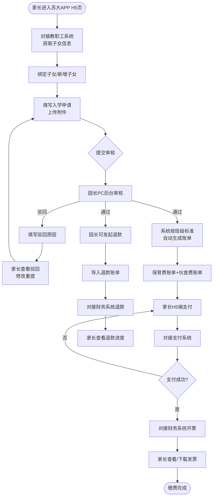

**流程说明：**

| 步骤 | 操作角色 | 操作内容 | 输出/对接系统 |
|------|---------|---------|-------------|
| 1 | 系统 | 对接教职工系统获取家长及子女信息 | 教职工系统 |
| 2 | 家长 | 绑定子女或新增子女 | — |
| 3 | 家长 | 填写入学申请，上传附件，提交审核 | — |
| 4 | 园长 | 审核报名材料，通过或驳回 | — |
| 5 | 系统 | 审核通过后按班级费用标准自动生成保育费+伙食费账单 | 配置管理 |
| 6 | 家长 | H5 端调起微信/支付宝支付 | 支付系统 |
| 7 | 系统 | 支付成功后对接财务系统自动开具电子发票 | 财务系统 |
| 8 | 园长 | 需要退款时导入退款账单并发起退款 | 财务系统 |

### 2.6 用户角色定义

| 角色名称 | 角色编码 | 角色描述 | 主要职责 | 获取方式 |
|---------|---------|---------|---------|---------|
| 家长 | PARENT | 大学教职工，通过苏大 APP H5 页操作 | 绑定子女、提交报名、支付费用、查看开票、查看退款、接收消息通知 | 苏大 APP 登录自动关联 |
| 园长 | PRINCIPAL | 幼儿园管理者，通过 PC 浏览器操作 | 审核报名、管理学生档案、配置费用标准、管理退款、查看账单和开票 | 系统后台创建 / 第三方系统 SSO 接入 |

---

## 三、项目建设内容

### 3.1 总体功能架构

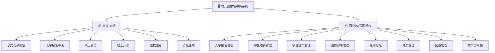

---

### 3.2 页面访问权限

#### 3.2.1 页面访问权限矩阵

| 页面/功能菜单 | 入口 | 家长 | 园长 | 未登录 |
|------------|------|------|------|--------|
| 子女绑定页 | H5 首页 | ✅ | — | ❌ |
| 入学报名填写页 | 子女列表→报名 | ✅ | — | ❌ |
| 账单支付页 | 子女列表→缴费 | ✅ | — | ❌ |
| 开票查看页 | 子女列表→发票 | ✅ | — | ❌ |
| 退款查看页 | 子女列表→退款 | ✅ | — | ❌ |
| 消息列表页 | H5 消息入口 | ✅ | — | ❌ |
| 报名审核列表 | 后台菜单 | — | ✅ | ❌ |
| 报名审核详情 | 审核列表→详情 | — | ✅ | ❌ |
| 学生缴费列表 | 后台菜单 | — | ✅ | ❌ |
| 学生档案列表 | 后台菜单 | — | ✅ | ❌ |
| 退款账单列表 | 后台菜单 | — | ✅ | ❌ |
| 账单信息页 | 后台菜单 | — | ✅ | ❌ |
| 开票管理页 | 后台菜单 | — | ✅ | ❌ |
| 配置管理页 | 后台菜单 | — | ✅ | ❌ |

图例：✅ 可访问  ❌ 无权限  — 该角色不涉及此端

#### 3.2.2 功能操作权限矩阵

**家长 H5 端：**

| 功能操作 | 所属模块 | 家长 |
|---------|---------|------|
| 查看/绑定教职工系统子女 | 子女信息绑定 | ✅ |
| 手动新增子女 | 子女信息绑定 | ✅ |
| 提交入学报名申请 | 入学报名申请 | ✅ |
| 保存草稿 | 入学报名申请 | ✅ |
| 查看账单 | 线上支付 | ✅ |
| 发起支付 | 线上支付 | ✅ |
| 查看开票/下载发票 | 线上开票 | ✅ |
| 查看退款明细和状态 | 退款查看 | ✅ |
| 查看消息列表/详情 | 消息通知 | ✅ |

**园长 PC 管理后台：**

| 功能操作 | 所属模块 | 园长 |
|---------|---------|------|
| 查询/筛选报名申请 | 入学报名管理 | ✅ |
| 查看报名详情（含附件预览） | 入学报名管理 | ✅ |
| 审核通过（单条/批量） | 入学报名管理 | ✅ |
| 审核驳回 + 填写原因 | 入学报名管理 | ✅ |
| 查看审核记录 | 入学报名管理 | ✅ |
| 查看操作日志 | 入学报名管理 | ✅ |
| 查看/筛选缴费列表 | 学生缴费管理 | ✅ |
| 生成缴费账单（含修改金额） | 学生缴费管理 | ✅ |
| 一键催缴 | 学生缴费管理 | ✅ |
| 导出缴费报表 | 学生缴费管理 | ✅ |
| 查看/筛选学生档案 | 学生档案管理 | ✅ |
| 修改学生信息（批量） | 学生档案管理 | ✅ |
| 批量升班 | 学生档案管理 | ✅ |
| 导入退款账单 | 退款账单管理 | ✅ |
| 查询退款账单 | 退款账单管理 | ✅ |
| 修改/删除退款账单 | 退款账单管理 | ✅ |
| 发起退款（单条/批量） | 退款账单管理 | ✅ |
| 查看应收/实收账单 | 账单信息 | ✅ |
| 导出账单报表（Excel） | 账单信息 | ✅ |
| 查看开票情况 | 开票管理 | ✅ |
| 手动重试开票 | 开票管理 | ✅ |
| 配置班级费用标准 | 配置管理 | ✅ |
| 查看历史配置记录 | 配置管理 | ✅ |

---

### 3.3 功能详细设计

#### 3.3.1 功能清单

| 序号 | 模块 | 一级子功能 | 二级子功能 | 功能描述 |
|------|------|----------|----------|---------|
| 1 | 家长端-子女绑定 | 子女信息同步 | 查看已同步子女 | 对接教职工系统，自动展示教职工名下已登记的子女信息，家长确认绑定 |
| 2 | 家长端-子女绑定 | 子女信息同步 | 手动新增子女 | 教职工系统中无记录的子女，家长手动填写姓名/性别/出生日期新增 |
| 3 | 家长端-子女绑定 | 子女列表 | 列表展示 | 展示已绑定的子女列表，显示姓名、性别、出生日期、绑定来源（系统同步/手动新增）、报名状态 |
| 4 | 家长端-入学报名 | 报名填写 | 基本信息 | 子女身份信息自动带出（姓名/性别/出生日期），填写：与子女关系、出生地、幼儿照片、证件类型+证件号、国籍、籍贯、户口所在地、家庭地址、入园年份、联络邮箱、是否独生（否时选孩次）；另填写父母基本信息（8字段）和配偶信息（6字段） |
| 5 | 家长端-入学报名 | 报名填写 | 健康信息 | 8项单选（残疾/心脏疾患/高热抽筋/哮喘/习惯性脱臼/家族遗传史/药物食物过敏）+ 出生证附件 + 其他病史；家族遗传史和药物食物过敏选「是」时展示补充说明文本框 |
| 6 | 家长端-入学报名 | 报名填写 | 附件上传 | 儿童户口（户主页+幼儿页，至少2张）、父母身份证（至少1张），支持 JPG/PNG/PDF |
| 7 | 家长端-入学报名 | 表单操作 | 保存草稿 | 不校验必填项，保存当前填写内容 |
| 8 | 家长端-入学报名 | 表单操作 | 提交报名 | 校验必填项+附件数量+邮箱格式，定位首个未通过字段，提交后状态变更为「审核中」 |
| 9 | 家长端-线上支付 | 账单查看 | 待支付列表 | 审核通过后按班级标准自动生成保育费+伙食费两个账单，待支付（橙色）/已支付（绿色） |
| 10 | 家长端-线上支付 | 支付操作 | 发起支付 | 调起微信支付（微信环境）或支付宝（非微信环境），金额按班级预设标准 |
| 11 | 家长端-线上支付 | 支付记录 | 记录查看 | 支付记录列表，支持按年份、班级（小班/中班/大班）筛选 |
| 12 | 家长端-线上开票 | 开票申请 | 填写开票信息 | 选择开票类型（个人/企业），填写发票抬头、税号（企业必填）、接收邮箱，提交后对接财务系统开票 |
| 13 | 家长端-线上开票 | 发票查看 | 发票列表 | 展示已开具的发票：发票号码/费用类型/开票类型/抬头/金额/开具时间/开票状态 |
| 14 | 家长端-线上开票 | 发票操作 | 预览/下载 | PDF 格式预览和下载 |
| 15 | 家长端-线上开票 | 开票历史 | 历史查看 | 所有历史开票记录，支持分页 |
| 16 | 家长端-退款查看 | 退款账单 | 列表展示 | 园长发起退款后展示退款账单列表：退款金额/费用类型/退款原因/退款状态 |
| 17 | 家长端-退款查看 | 退款账单 | 状态查看 | 退款状态：处理中（蓝色）/已退款（绿色）/退款失败（红色） |
| 18 | 家长端-消息通知 | 消息列表 | 列表展示 | 消息列表：消息标题/类型/时间/已读未读状态 |
| 19 | 家长端-消息通知 | 消息详情 | 查看详情 | 点击消息查看完整内容，支持跳转对应业务页面 |
| 20 | 园长端-报名管理 | 申请列表 | 查询/筛选 | 按幼儿姓名（模糊）、报名状态（待审核/已通过/已驳回/全部）、提交时间范围筛选 |
| 21 | 园长端-报名管理 | 申请列表 | 列表展示 | 幼儿姓名、家长姓名、入学年份、提交时间、审核状态标签（待审核蓝/已通过绿/已驳回红），分页20条 |
| 22 | 园长端-报名管理 | 审核操作 | 查看详情 | 完整信息+附件预览（图片/PDF） |
| 23 | 园长端-报名管理 | 审核操作 | 审核通过 | 单条通过+批量通过，确认弹窗后状态变更 |
| 24 | 园长端-报名管理 | 审核操作 | 审核驳回 | 必填驳回原因（≤200字），确认后家长端可见 |
| 25 | 园长端-报名管理 | 审核记录 | 记录查看 | 历史审核记录：审核人/时间/结果/驳回原因 |
| 26 | 园长端-报名管理 | 操作日志 | 日志查看 | 报名详情页内嵌操作日志时间线，记录保存草稿/提交/修改/审核通过/审核驳回等全操作链路，展示操作人/时间/类型/结果/备注 |
| 27 | 园长端-学生档案 | 档案列表 | 查询/筛选 | 按入学年份（2026/2025/2024）、幼儿姓名筛选 |
| 28 | 园长端-学生档案 | 档案列表 | 列表展示 | 幼儿姓名、性别、入学年份、家长姓名，分页20条 |
| 29 | 园长端-学生档案 | 档案操作 | 修改信息 | 单条修改+批量修改（选择多个学生统一修改班级等字段） |
| 30 | 园长端-学生缴费 | 缴费概览 | 应收/实收 | 顶部统计卡片：应收总额、实收总额、未收总额、缴费率，按学期统计 |
| 31 | 园长端-学生缴费 | 缴费列表 | 查询/筛选 | 按班级（小班/中班/大班）、缴费状态（已缴/未缴/部分缴）、幼儿姓名、学期筛选 |
| 32 | 园长端-学生缴费 | 缴费列表 | 列表展示 | 幼儿姓名、班级、保育费（应收金额+实收金额+状态标签）、伙食费（应收金额+实收金额+状态标签），分页20条 |
| 33 | 园长端-学生缴费 | 账单操作 | 生成账单 | 展示全部在园学生，默认按班级标准填充保育费和伙食费，支持单个修改金额，确认后批量生成并推送家长端 |
| 34 | 园长端-学生缴费 | 账单操作 | 一键催缴 | 勾选未缴/部分缴学生，确认弹窗后对接消息系统发送缴费提醒 |
| 35 | 园长端-学生缴费 | 账单操作 | 导出 | 当前筛选结果导出 Excel，上限 10000 条，文件命名：缴费明细_学期.xlsx |
| 36 | 园长端-学生档案 | 档案操作 | 批量升班 | 学年末批量操作：小班→中班、中班→大班、大班→标记毕业 |
| 37 | 园长端-退款管理 | 退款账单 | 导入 | Excel 模板导入退款账单（幼儿姓名、费用类型、退款金额、退款原因） |
| 38 | 园长端-退款管理 | 退款账单 | 查询/筛选 | 按幼儿姓名、退款状态（处理中/已退款/退款失败/全部）、时间范围筛选 |
| 39 | 园长端-退款管理 | 退款账单 | 列表展示 | 幼儿姓名、费用类型、退款金额、退款状态标签、退款原因、创建时间，分页20条 |
| 40 | 园长端-退款管理 | 退款操作 | 修改/删除 | 未发起的退款账单可修改金额或删除 |
| 41 | 园长端-退款管理 | 退款操作 | 发起退款 | 单条发起+批量发起，对接财务系统执行退款，状态同步家长端 |
| 42 | 园长端-账单信息 | 应收信息 | 汇总查看 | 按班级/费用类型汇总应收总额 |
| 43 | 园长端-账单信息 | 实收信息 | 汇总查看 | 按班级/费用类型汇总实收总额 |
| 44 | 园长端-账单信息 | 缴费明细 | 列表/导出 | 幼儿姓名、班级、费用类型、金额、支付状态、支付时间，支持导出 Excel |
| 45 | 园长端-开票管理 | 开票情况 | 查询/筛选 | 按幼儿姓名、开票状态（已开票/未开票/开票失败）、时间范围筛选 |
| 46 | 园长端-开票管理 | 开票情况 | 列表展示 | 幼儿姓名、费用类型、金额、开票状态标签、开具时间，分页20条 |
| 47 | 园长端-开票管理 | 异常处理 | 手动重试 | 开票失败的记录支持手动重新触发开票 |
| 48 | 园长端-配置管理 | 费用标准 | 班级配置 | 分别配置小班/中班/大班的保育费金额和伙食费金额 |
| 49 | 园长端-配置管理 | 费用标准 | 历史记录 | 查看费用标准变更历史（修改时间/修改前金额/修改后金额/操作人） |
| 50 | 园长端-第三方对接 | SSO接入 | 单点登录 | 对接第三方PC端业务系统，实现园长免登录跳转至本系统管理后台 |

---

#### 3.3.2 功能说明

##### 3.3.2.1 家长端 — 子女信息绑定

**（一）功能需求概述**

家长进入 H5 页面后，系统通过苏大 APP 登录态识别教职工身份，自动调用教职工系统接口获取其名下子女信息。家长可绑定已有子女、手动新增未在系统中的子女。

**（二）功能设计**

---

**子女列表**

| 列名 | 字段类型 | 说明 |
|------|---------|------|
| 幼儿姓名 | 文本 | — |
| 性别 | 文本 | — |
| 出生日期 | 文本 | YYYY-MM-DD |
| 绑定来源 | 标签 | 系统同步（蓝色）/ 手动新增（灰色） |
| 报名状态 | 标签 | 未报名（灰色）/ 已报名-审核中（蓝色）/ 已通过（绿色）/ 已驳回（红色）/ 已缴费（绿色） |
| 操作 | 按钮 | 未报名：[去报名]；已报名：[查看进度] |

- 列表为空时显示：「暂未绑定子女信息，系统将自动同步教职工系统中的子女数据」
- 教职工系统对接失败时显示提示并允许手动新增

---

**绑定/新增功能**

- 系统同步的子女：点击「绑定」确认关联，核心字段不可修改
- 手动新增的子女，表单字段：

| 字段名称 | 字段类型 | 长度限制 | 是否必填 | 默认值 | 说明 |
|---------|---------|---------|---------|-------|------|
| 幼儿姓名 | 文本输入框 | 2-20 | 是 | — | 支持中文 |
| 性别 | 单选（按钮组） | — | 是 | — | 选项：男 / 女 |
| 出生日期 | 日期选择器 | — | 是 | — | 不能晚于当天 |

---

**异常场景处理**

| 异常场景 | 触发条件 | 系统响应 |
|---------|---------|---------|
| 教职工系统对接失败 | 接口超时或返回错误 | 提示：「教职工信息同步异常，请稍后重试」，允许手动新增子女 |
| 子女已绑定 | 重复绑定同一子女 | Toast：「该子女已绑定，无需重复操作」 |

---

**用户操作流程图**

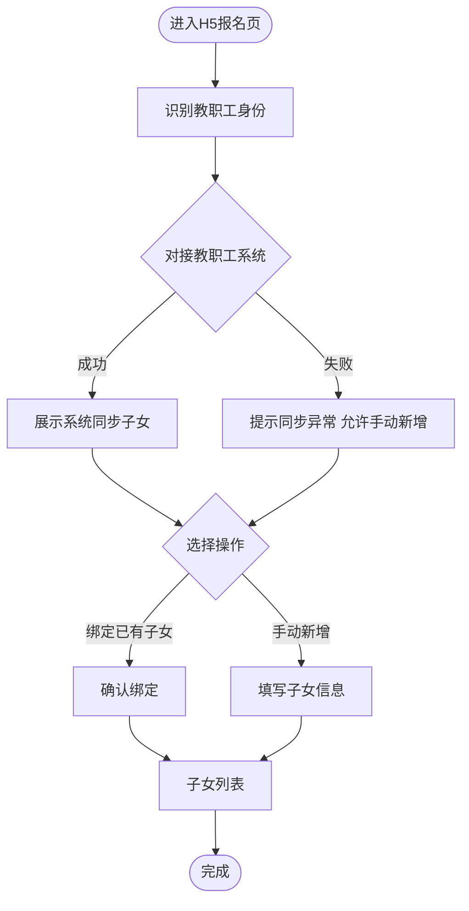

##### 3.3.2.2 家长端 — 入学报名申请

**（一）功能需求概述**

家长为已绑定的子女提交入学报名申请。子女身份信息从绑定信息自动带出，补充家长关系、出生地、户籍地址、健康信息等，上传幼儿照片、出生证、户口本、父母身份证等附件，提交后进入园长审核。

**（二）功能设计**

---

**新增/编辑功能**

**幼儿基本信息：**

| 字段名称 | 字段类型 | 长度限制 | 是否必填 | 默认值 | 说明 |
|---------|---------|---------|---------|-------|------|
| 与子女关系 | 下拉选择 | — | 是 | — | 选项：母亲 / 父亲 |
| 幼儿姓名 | 只读文本 | — | — | 绑定信息 | 自动带出，不可修改 |
| 性别 | 只读文本 | — | — | 绑定信息 | 自动带出 |
| 出生日期 | 日期选择器 | — | — | 绑定信息 | 自动带出 |
| 出生地 | 文本输入框 | 2-50 | 是 | — | — |
| 幼儿照片 | 图片上传 | 单张≤2MB | 是 | — | JPG/PNG，仅支持单张 |
| 证件类型 | 下拉选择 | — | 是 | — | 选项：身份证 / 护照 / 其他 |
| 证件号 | 文本输入框 | 5-30 | 条件必填 | — | 选择「身份证」时校验 18 位格式，选择「护照」时校验护照号格式 |
| 国籍 | 下拉选择 | — | 是 | 中国 | 选项：中国 / 其他国家 |
| 籍贯 | 文本输入框 | 2-30 | 否 | — | — |
| 户口所在地 | 文本输入框 | 2-100 | 是 | — | — |
| 家庭常驻地址 | 文本输入框 | 2-200 | 是 | — | — |
| 入园年份 | 下拉选择 | — | 是 | — | 选项：动态生成当前及前后年份 |
| 联络邮箱 | 文本输入框 | 5-50 | 否 | — | 格式校验：合法邮箱格式 |
| 是否独生 | 单选 | — | 是 | — | 选项：是 / 否；选「否」时展示孩次选择：一孩 / 二孩 / 三孩 |

**父母基本信息：**

| 字段名称 | 字段类型 | 长度限制 | 是否必填 | 默认值 | 说明 |
|---------|---------|---------|---------|-------|------|
| 家长姓名 | 文本输入框 | 2-20 | 是 | — | — |
| 性别 | 下拉选择 | — | 是 | — | 选项：男 / 女 |
| 工作单位 | 文本输入框 | 2-100 | 是 | — | — |
| 工号 | 文本输入框 | 2-20 | 是 | — | 与教职工系统工号保持一致 |
| 证件类型 | 下拉选择 | — | 是 | 身份证 | 选项：身份证 / 护照 / 其他 |
| 证件号 | 文本输入框 | 5-30 | 是 | — | 选「身份证」时校验 18 位格式 |
| 联系电话 | 文本输入框 | 11-11 | 是 | — | 格式校验：合法手机号 |
| 学历 | 下拉选择 | — | 是 | — | 选项：博士 / 硕士 / 本科 / 大专 / 其他 |

**配偶信息：**

| 字段名称 | 字段类型 | 长度限制 | 是否必填 | 默认值 | 说明 |
|---------|---------|---------|---------|-------|------|
| 配偶姓名 | 文本输入框 | 2-20 | 是 | — | — |
| 学历 | 下拉选择 | — | 是 | — | 选项：博士 / 硕士 / 本科 / 大专 / 其他 |
| 联系电话 | 文本输入框 | 11-11 | 是 | — | 格式校验：合法手机号 |
| 工作单位 | 文本输入框 | 2-100 | 是 | — | — |
| 证件类型 | 下拉选择 | — | 是 | 身份证 | 选项：身份证 / 护照 / 其他 |
| 证件号 | 文本输入框 | 5-30 | 是 | — | 选「身份证」时校验 18 位格式 |

**幼儿健康信息：**

| 字段名称 | 字段类型 | 是否必填 | 默认值 | 说明 |
|---------|---------|---------|-------|------|
| 是否残疾 | 单选 | 是 | 否 | 选项：是 / 否 |
| 是否有心脏疾患 | 单选 | 是 | 否 | 选项：是 / 否 |
| 是否高热抽筋 | 单选 | 是 | 否 | 选项：是 / 否 |
| 是否有哮喘 | 单选 | 是 | 否 | 选项：是 / 否 |
| 是否习惯性脱臼 | 单选 | 是 | 否 | 选项：是 / 否 |
| 是否有家族遗传史 | 单选 | 是 | 否 | 选项：是 / 否；选「是」时展示补充说明文本框（0-500字） |
| 是否有药物食物过敏 | 单选 | 是 | 否 | 选项：是 / 否；选「是」时展示补充说明文本框（0-500字） |
| 出生证附件 | 文件上传 | 单张 | 是 | JPG/PNG/PDF，单张≤[待确认]MB |
| 其他病史 | 文本域 | 0-1000 | 否 | — | 补充说明未覆盖的疾病或健康问题 |

**附件上传：**

| 附件名称 | 文件类型 | 数量限制 | 是否必填 | 说明 |
|---------|---------|---------|---------|------|
| 儿童户口附件 | JPG/PNG/PDF | 至少2张（户主页+幼儿页） | 是 | 单张≤[待确认]MB |
| 父母身份证附件 | JPG/PNG/PDF | 至少1张 | 是 | 单张≤[待确认]MB，支持正反面 |

- 编辑时回显已填数据
- 图片附件上传后展示缩略图，右上角有删除按钮
- PDF 附件展示文件图标+文件名

---

**提交校验**

| 校验项 | 规则 | 提示文案 |
|--------|------|---------|
| 与子女关系 | 非空 | 「请选择与子女的关系」 |
| 出生地 | 非空 | 「请填写出生地」 |
| 幼儿照片 | 非空 | 「请上传幼儿照片」 |
| 证件类型（幼儿） | 非空 | 「请选择证件类型」 |
| 证件号（幼儿） | 非空 + 格式校验 | 「请填写证件号」/「请输入有效的证件号」 |
| 国籍 | 非空 | 「请选择国籍」 |
| 户口所在地 | 非空 | 「请填写户口所在地」 |
| 家庭常驻地址 | 非空 | 「请填写家庭常驻地址」 |
| 入园年份 | 非空 | 「请选择入园年份」 |
| 是否独生 | 非空 | 「请选择是否独生」 |
| 孩次 | 条件必填（选「否」时） | 「请选择孩次」 |
| 父母信息（8字段） | 非空 | 逐项校验：「请填写/选择[字段名称]」 |
| 配偶信息（6字段） | 非空 | 逐项校验：「请填写/选择[字段名称]」 |
| 健康信息（8项+出生证） | 非空 | 逐项校验：「请选择[字段名称]」 |
| 出生证附件 | 非空 | 「请上传出生证附件」 |
| 儿童户口附件 | 非空，至少2张 | 「请上传儿童户口附件（户主页和幼儿页）」 |
| 父母身份证附件 | 非空 | 「请上传父母身份证附件」 |
| 联络邮箱 | 格式校验 | 「请输入有效的邮箱地址」 |
| 家长联系电话 | 格式校验 | 「请输入有效的手机号」 |
| 配偶联系电话 | 格式校验 | 「请输入有效的手机号」 |

- 点击「保存草稿」不触发校验
- 点击「提交」触发全部校验，定位到首个未通过字段并滚动至视图内

---

**操作日志记录**

报名申请全生命周期操作均自动记录日志，在园长端报名详情页以时间线形式展示。

| 操作类型 | 触发时机 | 记录内容 |
|---------|---------|---------|
| 保存草稿 | 家长点击「保存草稿」 | 操作人（家长姓名）、操作时间、操作类型：保存草稿 |
| 提交报名 | 家长点击「提交报名」 | 操作人（家长姓名）、操作时间、操作类型：提交报名、结果：成功 |
| 修改报名 | 家长修改后重新提交 | 操作人（家长姓名）、操作时间、操作类型：修改报名、结果：成功 |
| 审核通过 | 园长点击「审核通过」 | 操作人（园长）、操作时间、操作类型：审核通过、结果：通过 |
| 审核驳回 | 园长点击「审核驳回」 | 操作人（园长）、操作时间、操作类型：审核驳回、结果：驳回、备注：驳回原因 |

- 日志记录由系统自动触发，不可手动编辑或删除
- 日志记录永久保留，与报名记录关联
- 园长端报名详情页底部以时间线形式展示完整操作链路

---

**异常场景处理**

| 异常场景 | 触发条件 | 系统响应 |
|---------|---------|---------|
| 必填项为空 | 提交时必填未填 | 定位到首个未填字段，提示：「请填写[字段名]」 |
| 附件格式/数量不符 | 选择文件时校验 | 提示具体限制条件 |
| 提交时网络中断 | 接口超时或失败 | 提示：「网络异常，请检查网络后重试」，表单自动存为草稿 |
| 未绑定子女 | 进入报名页时无绑定子女 | 引导先完成子女绑定 |

---

**用户操作流程图**

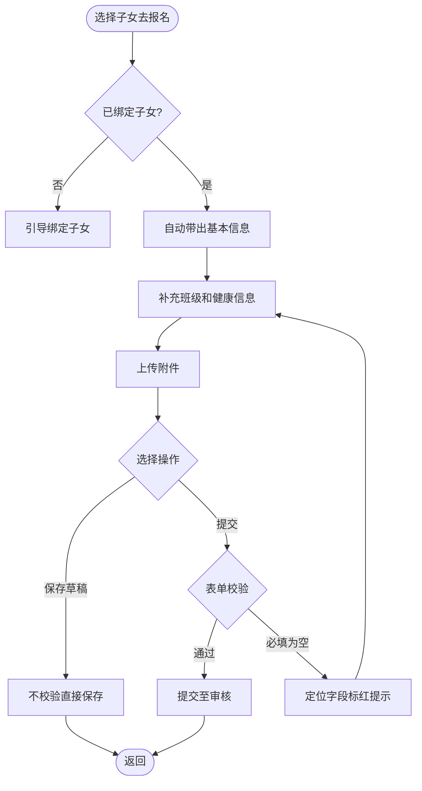

##### 3.3.2.3 家长端 — 线上支付

**（一）功能需求概述**

园长审核通过后，系统按班级费用标准自动生成保育费账单和伙食费账单。家长查看并按需支付，支持微信/支付宝。

**（二）功能设计**

---

**查看账单**

| 列名 | 字段类型 | 说明 |
|------|---------|------|
| 费用项目 | 文本 | 保育费 / 伙食费 |
| 金额 | 文本 | ¥[金额]（按班级预设标准） |
| 支付状态 | 标签 | 待支付（橙色）/ 已支付（绿色）/ 已过期（灰色） |
| 操作 | 按钮 | 待支付：[去支付]；已支付：[查看发票]；已过期：按钮置灰 |

- 报名尚未通过审核时显示：「审核通过后自动生成账单」

---

**支付功能**

- 点击「去支付」→ 系统调用支付平台统一下单 → 调起微信/支付宝
- 支付金额按班级预设标准（保育费=班级保育费标准，伙食费=班级伙食费标准）

**支付结果处理：**

| 支付结果 | 页面行为 |
|---------|---------|
| 成功 | 展示成功页，3 秒后跳回账单页，状态变为「已支付」，触发财务系统开票 |
| 失败 | 展示失败原因，提供「重新支付」 |
| 取消 | 返回账单页，状态不变 |

---

**支付记录**

| 列名 | 字段类型 | 说明 |
|------|---------|------|
| 幼儿姓名 | 文本 | — |
| 费用类型 | 标签 | 保育费（蓝色）/ 伙食费（橙色） |
| 金额 | 文本 | ¥[金额] |
| 支付状态 | 标签 | 已支付（绿色） |
| 支付时间 | 文本 | YYYY-MM-DD HH:mm:ss |
| 所在班级 | 文本 | 小班 / 中班 / 大班 |

**支付记录 — 筛选功能：**

| 筛选字段 | 字段类型 | 说明 |
|---------|---------|------|
| 年份 | 下拉选择 | 选项：动态生成入学年份列表 |
| 班级 | 下拉选择 | 选项：小班 / 中班 / 大班 / 全部 |

---

**业务规则**

1. 费用标准由园长在配置管理中按班级预设，审核通过后自动套用
2. 保育费和伙食费分别支付，互不影响
3. 两项均支付完成后，报名状态变更为「已缴费」

---

**异常场景处理**

| 异常场景 | 触发条件 | 系统响应 |
|---------|---------|---------|
| 支付失败 | 余额不足/银行卡限额等 | 展示失败原因，保留订单，可重新支付 |
| 支付超时 | 支付平台接口超时 | 提示：「支付超时，请重新尝试」 |
| 重复支付 | 订单已支付时再次发起 | 提示：「该账单已支付，无需重复操作」 |
| 支付服务不可用 | 微信/支付宝异常 | 提示：「支付服务暂时不可用，请稍后重试」 |

---

**用户操作流程图**

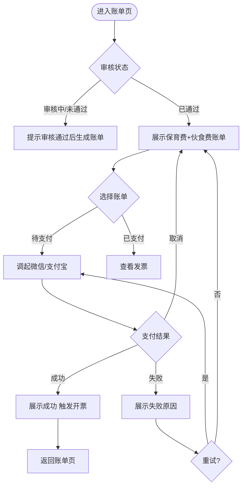

##### 3.3.2.4 家长端 — 线上开票

**（一）功能需求概述**

家长支付完成后，手动选择开票类型（个人/企业），填写发票抬头、税号（企业必填）和接收邮箱，提交后系统对接财务系统开具电子发票并发送至邮箱。家长可查看开票历史、下载发票 PDF。

**（二）功能设计**

---

**开票申请**

支付完成后在账单详情页展示「申请开票」按钮，点击进入开票信息填写页。

| 字段名称 | 字段类型 | 长度限制 | 是否必填 | 默认值 | 说明 |
|---------|---------|---------|---------|-------|------|
| 开票类型 | 单选 | — | 是 | 个人 | 选项：个人 / 企业 |
| 发票抬头 | 文本输入框 | 2-100 | 是 | — | 个人：填写姓名；企业：填写企业全称 |
| 税号 | 文本输入框 | 15-20 | 条件必填 | — | 选择「企业」时展示，个人时不展示；格式校验：合法税号 |
| 接收邮箱 | 文本输入框 | 5-50 | 是 | — | 电子发票接收邮箱，格式校验：合法邮箱 |

- 选择「个人」：发票抬头 + 接收邮箱必填，税号隐藏
- 选择「企业」：发票抬头 + 税号 + 接收邮箱必填
- 提交后调用财务系统开票接口
- 每笔已支付的账单可独立申请开票，互不影响

---

**发票列表**

| 列名 | 字段类型 | 说明 |
|------|---------|------|
| 发票号码 | 文本 | 财务系统返回，全局唯一 |
| 费用类型 | 标签 | 保育费（蓝色）/ 伙食费（橙色） |
| 开票类型 | 标签 | 个人（灰色）/ 企业（蓝色） |
| 发票抬头 | 文本 | — |
| 金额 | 文本 | ¥[金额] |
| 开具时间 | 文本 | YYYY-MM-DD HH:mm:ss |
| 开票状态 | 标签 | 处理中（蓝色）/ 已开票（绿色）/ 开票失败（红色） |
| 操作 | 按钮 | 已开票：[预览] [下载PDF]；处理中：—；开票失败：[重新申请] |

- 无发票时显示：「暂无电子发票，支付完成后可申请开票」

---

**开票历史**

- 展示所有历史开票记录，与发票列表字段一致
- 分页默认每页 20 条

---

**业务规则**

1. 支付成功后家长手动填写开票信息并提交，系统不自动开票
2. 每笔支付（保育费/伙食费）可分别申请开票
3. 发票由财务系统生成后发送至家长填写的接收邮箱
4. 开票失败时可重新填写信息再次申请

---

**异常场景处理**

| 异常场景 | 触发条件 | 系统响应 |
|---------|---------|---------|
| 财务系统开票失败 | 接口异常或超时 | 状态标记「开票失败」，家长可「重新申请」 |
| 发票文件不存在 | 文件未生成或损坏 | 提示：「发票文件异常，请联系园方」 |
| 税号格式错误 | 企业开票时税号输入非法 | 实时校验，提示：「请输入有效的税号」 |
| 邮箱格式错误 | 接收邮箱格式非法 | 实时校验，提示：「请输入有效的邮箱地址」 |
| 已开票重复申请 | 已成功开票的账单再次申请 | 「申请开票」按钮置灰，Tooltip：「该账单已申请开票」 |

---

**用户操作流程图**

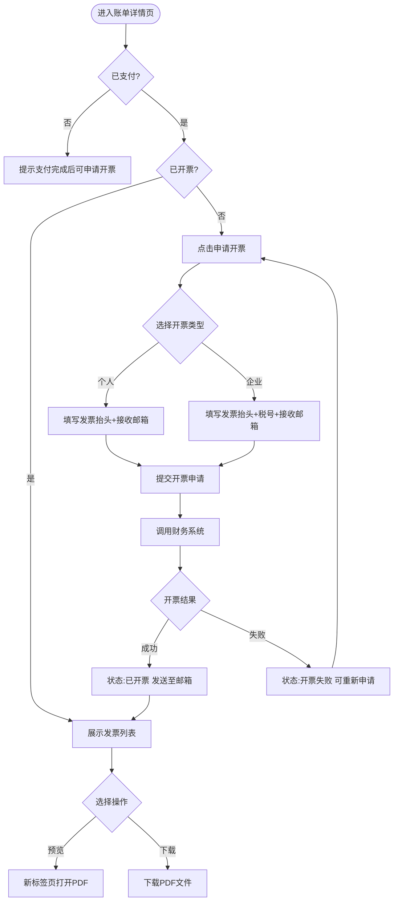

##### 3.3.2.5 家长端 — 退款查看

**（一）功能需求概述**

园长在后台发起退款后，家长可在 H5 端查看退款账单明细和退款状态。

**（二）功能设计**

---

**退款账单列表**

| 列名 | 字段类型 | 说明 |
|------|---------|------|
| 幼儿姓名 | 文本 | — |
| 费用类型 | 标签 | 保育费（蓝色）/ 伙食费（橙色） |
| 退款金额 | 文本 | ¥[金额] |
| 退款原因 | 文本 | 园长填写的退款原因 |
| 退款状态 | 标签 | 处理中（蓝色）/ 已退款（绿色）/ 退款失败（红色） |
| 创建时间 | 文本 | YYYY-MM-DD HH:mm |

- 无退款记录时显示：「暂无退款记录」
- 分页默认每页 20 条

---

**业务规则**

1. 退款由园长在后台发起，家长端仅查看，不可操作
2. 退款状态实时同步财务系统返回结果

---

**异常场景处理**

| 异常场景 | 触发条件 | 系统响应 |
|---------|---------|---------|
| 财务系统退款失败 | 退款接口返回失败 | 状态标记为「退款失败」，展示失败原因 |

---

**用户操作流程图**

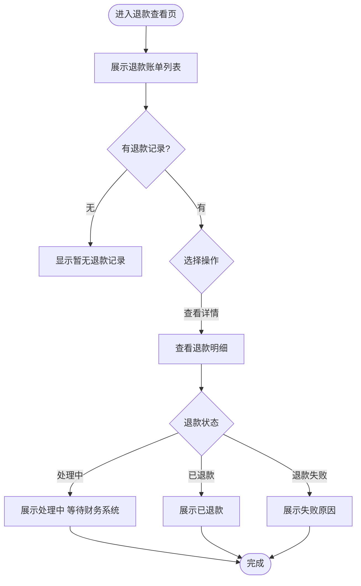

##### 3.3.2.6 家长端 — 消息通知

**（一）功能需求概述**

系统对接苏大 APP 消息体系，在关键业务节点向家长推送通知（报名进度/缴费提醒/退款通知/开票通知）。家长可在消息列表中查看详情并跳转至对应页面。

**（二）功能设计**

---

**消息列表**

| 列名 | 字段类型 | 说明 |
|------|---------|------|
| 消息标题 | 文本 | — |
| 消息类型 | 标签 | 报名进度（蓝色）/ 缴费提醒（橙色）/ 退款通知（红色）/ 开票通知（绿色） |
| 发送时间 | 文本 | YYYY-MM-DD HH:mm |
| 已读状态 | 标签 | 未读（加粗+红点）/ 已读（普通） |

- 列表为空时显示：「暂无消息」
- 分页默认每页 20 条

---

**消息详情**

- 点击消息查看完整内容
- 消息关联业务数据时，底部展示「查看详情」按钮，点击跳转对应页面

**消息推送触发节点：**

| 触发节点 | 消息类型 | 推送内容模板 |
|---------|---------|------------|
| 园长审核通过 | 报名进度 | 「[幼儿姓名]的入学报名已审核通过，请查看账单并完成缴费」 |
| 园长审核驳回 | 报名进度 | 「[幼儿姓名]的入学报名未通过审核，原因：[驳回原因]，请修改后重新提交」 |
| 账单生成 | 缴费提醒 | 「[幼儿姓名]的保育费/伙食费账单已生成，请及时缴费」 |
| 支付完成 | 开票通知 | 「[幼儿姓名]的[保育费/伙食费]已缴费成功，电子发票已生成」 |
| 退款发起 | 退款通知 | 「[幼儿姓名]的[费用类型]退款已发起，金额 ¥[金额]」 |
| 退款完成 | 退款通知 | 「[幼儿姓名]的[费用类型]退款已到账」 |

---

**业务规则**

1. 消息对接苏大 APP 消息体系，由系统在对应节点自动触发推送
2. 消息保留期限 [待确认] 天

---

**异常场景处理**

| 异常场景 | 触发条件 | 系统响应 |
|---------|---------|---------|
| 消息列表加载失败 | 接口超时或网络异常 | 提示：「消息加载失败，请重试」，提供重试按钮 |
| 消息推送失败 | 苏大 APP 消息接口异常 | 后台记录失败日志，定时重试，不影响业务操作 |
| 关联业务页面无法跳转 | 报名记录已删除或无权限 | 提示：「该记录不存在或已被删除」 |

---

**用户操作流程图**

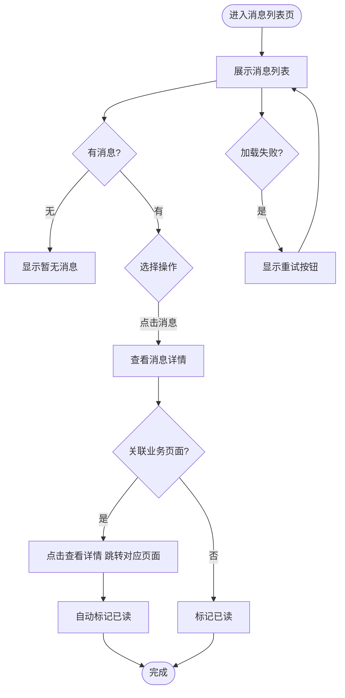

##### 3.3.2.7 园长端 — 入学报名管理

**（一）功能需求概述**

园长在 PC 后台查看和管理所有报名申请：按条件查询、查看详情（含附件预览）、审核通过（单条/批量）、审核驳回（填写原因）、查看审核记录。

**（二）功能设计**

---

**查询/筛选功能**

| 筛选字段 | 字段类型 | 说明 |
|---------|---------|------|
| 幼儿姓名 | 文本输入框 | 支持模糊搜索 |
| 报名状态 | 下拉选择 | 选项：待审核 / 已通过 / 已驳回 / 全部 |
| 提交时间 | 日期范围 | 格式：YYYY-MM-DD |

- 默认展示「待审核」状态
- 筛选后列表实时刷新

---

**列表功能**

| 列名 | 字段类型 | 说明 |
|------|---------|------|
| 幼儿姓名 | 文本 | — |
| 家长姓名 | 文本 | — |
| 入学年份 | 文本 | YYYY |
| 提交时间 | 文本 | YYYY-MM-DD HH:mm |
| 审核状态 | 标签 | 待审核（蓝色）/ 已通过（绿色）/ 已驳回（红色） |
| 操作 | 操作列 | [查看详情] [通过] [驳回] |

- 分页默认每页 20 条
- 支持批量勾选，勾选后显示「批量通过」按钮
- 列表为空时显示：「暂无待审核的报名申请」

---

**查看详情**

- 右侧抽屉展示，按区块分组展示报名全部信息：

| 区块 | 展示字段 | 说明 |
|------|---------|------|
| 幼儿基本信息 | 幼儿姓名、性别、幼儿照片（缩略图）、出生日期、出生地、与子女关系、证件类型、证件号、国籍、籍贯、户口所在地、家庭常驻地址、入园年份、联络邮箱、是否独生（否时展示孩次） | 两列网格布局，照片单独一行展示缩略图 |
| 父母基本信息 | 家长姓名、性别、工作单位、工号、证件类型、证件号、联系电话（脱敏）、学历 | 两列网格布局 |
| 配偶信息 | 配偶姓名、学历、联系电话（脱敏）、工作单位、证件类型、证件号 | 两列网格布局 |
| 幼儿健康信息 | 是否残疾、是否心脏疾患、是否高热抽筋、是否有哮喘、是否习惯性脱臼、是否有家族遗传史、是否有药物食物过敏、其他病史、出生证附件 | 两列网格布局，出生证附件单独展示缩略图 |
| 附件材料 | 儿童户口（户主页+幼儿页）、父母身份证 | 缩略图展示，点击放大预览 |
| 审核日志 | 操作时间线：操作人、操作时间、操作类型（颜色标签）、操作结果 | 时间线倒序，最新操作在上 |

- 附件：图片缩略图点击放大，PDF 文件展示文件图标+文件名并提供下载入口；预览失败时提供「下载到本地查看」按钮
- 各区块以白色背景卡片分隔，卡片标题含 emoji 图标区分

---

**审核通过/驳回**

- 单个通过：点击操作列「通过」→ 确认弹窗 → 状态变更，学生信息进入档案
- 批量通过：勾选多条 →「批量通过」→ 确认弹窗 → 批量变更，学生信息进入档案
- 驳回：点击「驳回」→ 弹窗填写原因（必填，≤200字）→ 确认

---

**审核记录**

- 列表展示审核历史：审核时间、审核人、审核结果、驳回原因

---

**操作日志**

- 报名详情页底部展示操作日志时间线，串联家长端和园长端全操作链路
- 时间线展示规则：最新操作在最上方，按时间倒序排列

| 显示字段 | 说明 |
|---------|------|
| 操作人 | 家长姓名（家长端操作）/ 园长（园长端操作） |
| 操作时间 | YYYY-MM-DD HH:mm:ss |
| 操作类型 | 标签：保存草稿（灰色）/ 提交报名（蓝色）/ 修改报名（蓝色）/ 审核通过（绿色）/ 审核驳回（红色） |
| 操作结果 | 成功 / 失败 |
| 备注 | 驳回原因等补充信息（有则展示，无则隐藏） |

- 时间线示例：
  1. 2026-05-04 10:15 | 园长 | 审核通过（绿色标签）| 结果：通过
  2. 2026-05-03 14:30 | 张建国 | 提交报名（蓝色标签）| 结果：成功

---

**业务规则**

1. 审核通过后不可撤回，通过后学生信息进入档案，缴费账单在「学生缴费管理」模块统一生成
2. 审核通过后学生信息进入档案，缴费账单由园长在「学生缴费管理」模块按学期统一生成
3. 驳回原因必填
4. 历史审核记录永久保留

---

**异常场景处理**

| 异常场景 | 触发条件 | 系统响应 |
|---------|---------|---------|
| 无待审核记录 | 筛选结果为空 | 显示：「暂无待审核的报名申请」 |
| 附件预览失败 | 文件不存在或不支持 | 显示「预览加载失败」+「下载到本地查看」按钮 |
| 驳回原因为空 | 确认驳回时未填原因 | 输入框标红，提示：「请填写驳回原因」 |
| 批量通过含非待审核 | 勾选含已处理记录 | 仅处理待审核记录，跳过已处理 |

---

**用户操作流程图**

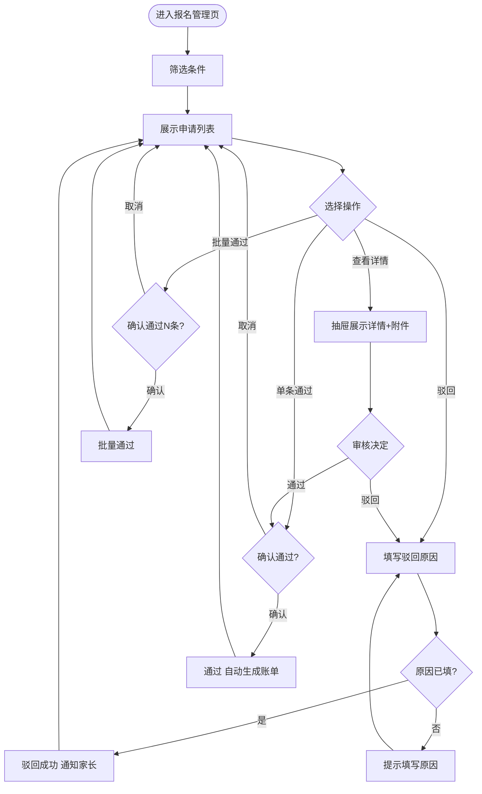

##### 3.3.2.8 园长端 — 学生档案管理

**（一）功能需求概述**

园长查看和管理已录取学生档案，支持按入学年份筛选、修改学生信息（批量）、学年末批量升班操作。

**（二）功能设计**

---

**查询/筛选功能**

| 筛选字段 | 字段类型 | 说明 |
|---------|---------|------|
| 入学年份 | 下拉选择 | 选项：2026 / 2025 / 2024 / 全部 |
| 幼儿姓名 | 文本输入框 | 支持模糊搜索 |

---

**列表功能**

| 列名 | 字段类型 | 说明 |
|------|---------|------|
| 幼儿姓名 | 文本 | — |
| 性别 | 文本 | — |
| 入学年份 | 文本 | YYYY |
| 家长姓名 | 文本 | — |

- 分页默认每页 20 条
- 支持批量勾选，勾选后显示「批量修改」「批量升班」按钮
- 列表为空时显示：「暂无学生档案」

---

**修改信息**

- 单条修改：点击编辑按钮 → 修改入学年份等信息 → 保存
- 批量修改：勾选多条 →「批量修改」→ 选择要修改的字段 → 统一修改

**修改信息字段定义：**

| 字段名称 | 字段类型 | 长度限制 | 是否必填 | 默认值 | 说明 |
|---------|---------|---------|---------|-------|------|
| 入学年份 | 下拉选择 | — | 是 | 当前入学年份 | 选项：2026 / 2025 / 2024 |
| 备注 | 文本域 | 0-500 | 否 | — | 园长记录的特殊说明 |

---

**批量升班**

- 点击「批量升班」→ 二次确认弹窗 → 展示变更明细（N 名小班→中班，M 名中班→大班，K 名大班→毕业）
- 确认后批量更新班级
- 大班升班后标记状态为「已毕业」

---

**异常场景处理**

| 异常场景 | 触发条件 | 系统响应 |
|---------|---------|---------|
| 未勾选学生 | 点击批量操作时无勾选 | 按钮置灰，不可操作 |
| 批量升班确认 | 点击批量升班 | 二次确认：「确定对选中的 N 名学生执行升班操作？小班→中班 [X]人，中班→大班 [Y]人，大班→毕业 [Z]人」 |

---

**用户操作流程图**

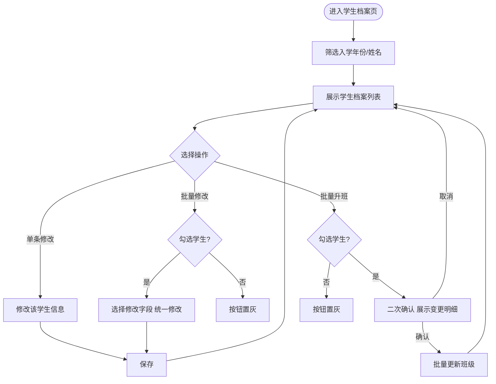

##### 3.3.2.9 园长端 — 学生缴费管理

**（一）功能需求概述**

园长每学期面向全部在园学生统一生成缴费账单（保育费+伙食费）。系统默认按班级费用标准填充金额，支持单个调整后批量确认生成。生成后家长端同步可见账单并支付。提供催缴和导出功能。

**（二）功能设计**

---

**统计概览**

页面顶部展示统计卡片：

| 统计项 | 说明 |
|--------|------|
| 应收总额 | 已生成账单金额之和，按班级+费用类型分组 |
| 实收总额 | 已支付账单金额之和 |
| 未收总额 | 应收 − 实收 |
| 缴费率 | 实收 / 应收 × 100% |

---

**查询/筛选功能**

| 筛选字段 | 字段类型 | 说明 |
|---------|---------|------|
| 班级 | 下拉选择 | 选项：小班 / 中班 / 大班 / 全部 |
| 缴费状态 | 下拉选择 | 选项：已缴 / 未缴 / 部分缴 / 全部 |
| 幼儿姓名 | 文本输入框 | 支持模糊搜索 |
| 学期 | 下拉选择 | 选项：动态生成（2026年秋季 / 2026年春季等） |

- 筛选后列表实时刷新
- 重置按钮清空所有筛选条件

---

**列表功能**

| 列名 | 字段类型 | 说明 |
|------|---------|------|
| 幼儿姓名 | 文本 | — |
| 班级 | 文本 | 小班 / 中班 / 大班 |
| 保育费-应收 | 文本 | ¥[金额] |
| 保育费-实收 | 文本 | ¥[金额]，未收显示「-」 |
| 保育费-状态 | 标签 | 已缴（绿色）/ 未缴（橙色）/ 部分缴（蓝色） |
| 伙食费-应收 | 文本 | ¥[金额] |
| 伙食费-实收 | 文本 | ¥[金额]，未收显示「-」 |
| 伙食费-状态 | 标签 | 已缴（绿色）/ 未缴（橙色）/ 部分缴（蓝色） |
| 操作 | 操作列 | 未生成账单：[生成账单]；已生成未缴：[催缴]；已缴：— |

- 分页默认每页 20 条
- 支持批量勾选，勾选后显示「一键催缴」按钮
- 列表为空时显示：「暂无学生缴费数据，请先生成账单」

---

**生成账单功能**

- 点击「生成账单」按钮，弹出弹窗，标题显示「生成缴费账单」
- 弹窗内容：

| 区域 | 说明 |
|------|------|
| 学期选择 | 下拉选择当前学期（如 2026年秋季学期） |
| 费用标准参考 | 展示当前班级费用标准（小班保育¥x 伙食¥y / 中班保育¥x 伙食¥y / 大班保育¥x 伙食¥y） |
| 学生列表 | 全部在园学生，每行展示姓名、班级、保育费金额（可编辑输入框）、伙食费金额（可编辑输入框），默认按班级标准填充 |
| 应收合计 | 实时计算当前所有学生金额总和 |

- 金额输入框支持 2 位小数，校验 ≥0
- 点击「确认生成账单」→ 批量生成 → 家长端同步可见 → 列表刷新
- 已存在未支付账单的学生，新账单覆盖旧账单

---

**一键催缴**

- 勾选未缴/部分缴学生 →「一键催缴」→ 确认弹窗：「确定向选中的 N 名学生发送缴费提醒？」
- 确认后对接消息系统发送推送通知
- 推送失败：提示失败明细，不影响已成功推送的记录

---

**导出功能**

- 导出格式：Excel（.xlsx）
- 导出范围：当前筛选条件下的全部数据
- 文件命名：缴费明细_[学期].xlsx
- 上限：10000 条

---

**业务规则**

1. 账单按学期生成，每个学生每学期生成保育费+伙食费两笔账单
2. 生成账单时默认取配置管理中对应班级的费用标准
3. 支持生成前逐个修改金额，确认后批量生成
4. 生成后金额不可再修改
5. 已毕业学生不纳入账单生成范围

---

**异常场景处理**

| 异常场景 | 触发条件 | 系统响应 |
|---------|---------|---------|
| 班级费用标准未配置 | 保育费或伙食费为 0 | 提示：「[班级]的费用标准未配置，请先在配置管理中设置」 |
| 金额输入负数 | 编辑金额时输入负数 | 实时校验，提示：「请输入有效金额」，阻止确认 |
| 消息推送失败 | 催缴时消息接口异常 | 提示失败明细（学生姓名+失败原因），已成功推送的记录正常处理 |
| 无学生数据 | 无在园学生 | 列表显示：「暂无在园学生，请先完成招生」 |

---

**用户操作流程图**

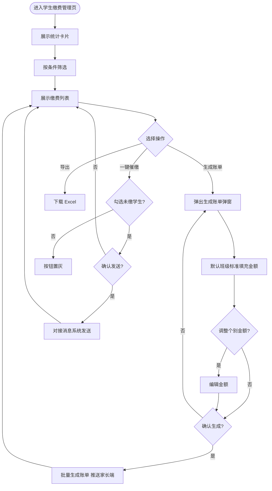

##### 3.3.2.10 园长端 — 退款账单管理

**（一）功能需求概述**

园长在后台管理退款：导入退款账单（Excel）、查询、修改（未发起前）、删除（未发起前）、发起退款（单条/批量），对接财务系统执行退款。家长端同步查看退款状态。

**（二）功能设计**

---

**退款账单导入**

- 提供「下载导入模板」（Excel），模板列：幼儿姓名、费用类型、退款金额、退款原因
- 导入校验：幼儿姓名是否存在、金额是否合法
- 校验通过：导入成功，提示「成功导入 N 条退款账单」
- 校验失败：提示失败明细（行号+原因），支持下载错误报告

---

**查询/筛选功能**

| 筛选字段 | 字段类型 | 说明 |
|---------|---------|------|
| 幼儿姓名 | 文本输入框 | 支持模糊搜索 |
| 退款状态 | 下拉选择 | 选项：处理中 / 已退款 / 退款失败 / 全部 |
| 创建时间 | 日期范围 | 格式：YYYY-MM-DD |

---

**列表功能**

| 列名 | 字段类型 | 说明 |
|------|---------|------|
| 幼儿姓名 | 文本 | — |
| 费用类型 | 标签 | 保育费（蓝色）/ 伙食费（橙色） |
| 退款金额 | 文本 | ¥[金额] |
| 退款状态 | 标签 | 处理中（蓝色）/ 已退款（绿色）/ 退款失败（红色） |
| 退款原因 | 文本 | — |
| 创建时间 | 文本 | YYYY-MM-DD HH:mm |
| 操作 | 操作列 | 未发起：[编辑] [删除] [发起退款]；已发起/已退款/退款失败：— |

- 分页默认每页 20 条
- 列表为空时显示：「暂无退款账单」

---

**修改/删除**

- 仅「未发起」状态的退款账单可修改金额和删除
- 已发起的退款不可修改或删除
- 删除类型：软删除，删除后状态标记为「已删除」，数据保留以支持审计回溯，不在列表中展示

---

**发起退款**

- 单条发起：点击「发起退款」→ 确认弹窗 → 对接财务系统
- 批量发起：勾选多条→「批量发起退款」→ 确认弹窗
- 确认弹窗（单条）：「确定对 [幼儿姓名] 的 [费用类型] 发起退款 ¥[金额]？」
- 发起后状态变更为「处理中」，等待财务系统回执

---

**业务规则**

1. 退款由园长主动发起，家长无需申请
2. 退款对接财务系统，以财务系统回执为准更新状态
3. 已发起/已退款/退款失败的记录不可修改或删除

---

**异常场景处理**

| 异常场景 | 触发条件 | 系统响应 |
|---------|---------|---------|
| 导入格式不符 | 模板列不匹配或必填列缺失 | 提示：「导入模板格式错误，请下载最新模板」 |
| 导入校验失败 | 幼儿姓名不存在/金额非法 | 提示失败明细（行号+原因），支持下载错误报告 |
| 财务系统退款失败 | 退款接口返回失败 | 标记「退款失败」，展示失败原因，支持重新发起 |

---

**用户操作流程图**

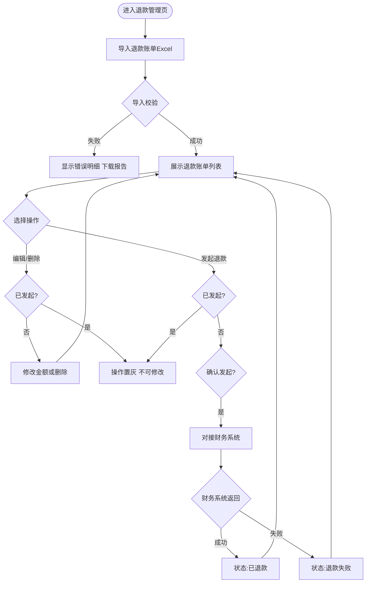

##### 3.3.2.11 园长端 — 账单信息

**（一）功能需求概述**

园长查看全园应收和实收账单汇总，按班级/费用类型/支付状态筛选，导出缴费明细 Excel。

**（二）功能设计**

---

**统计概览**

页面顶部展示统计卡片：

| 统计项 | 说明 |
|--------|------|
| 应收总额 | 已生成账单金额之和，按班级+费用类型分组 |
| 实收总额 | 已支付账单金额之和 |
| 未收总额 | 应收 − 实收 |
| 保育费收入/伙食费收入 | 按费用类型拆分 |
| 各班应收/实收 | 小班 / 中班 / 大班分别统计 |

---

**缴费明细**

| 列名 | 字段类型 | 说明 |
|------|---------|------|
| 幼儿姓名 | 文本 | — |
| 班级 | 文本 | 小班 / 中班 / 大班 |
| 费用类型 | 标签 | 保育费（蓝色）/ 伙食费（橙色） |
| 金额 | 文本 | ¥[金额] |
| 支付状态 | 标签 | 待支付（橙色）/ 已支付（绿色）/ 已过期（灰色） |
| 支付时间 | 文本 | 已支付显示 YYYY-MM-DD HH:mm:ss，未支付显示 "-" |

---

**筛选功能**

| 筛选字段 | 字段类型 | 说明 |
|---------|---------|------|
| 班级 | 下拉选择 | 选项：小班 / 中班 / 大班 / 全部 |
| 费用类型 | 下拉选择 | 选项：保育费 / 伙食费 / 全部 |
| 支付状态 | 下拉选择 | 选项：待支付 / 已支付 / 已过期 / 全部 |
| 支付时间 | 日期范围 | 格式：YYYY-MM-DD |

---

**导出功能**

- 导出格式：Excel（.xlsx）
- 导出范围：当前筛选条件下的全部数据
- 文件命名：缴费明细_[开始日期]_[结束日期].xlsx
- 导出上限：10000 条，超出时提示缩小筛选范围

---

**异常场景处理**

| 异常场景 | 触发条件 | 系统响应 |
|---------|---------|---------|
| 无数据 | 筛选条件下无记录 | 明细列表显示：「暂无缴费数据」，统计卡片显示 0 |
| 导出超限 | 导出超过 10000 条 | 提示：「数据量过大，请缩小筛选范围后导出」 |

---

**用户操作流程图**

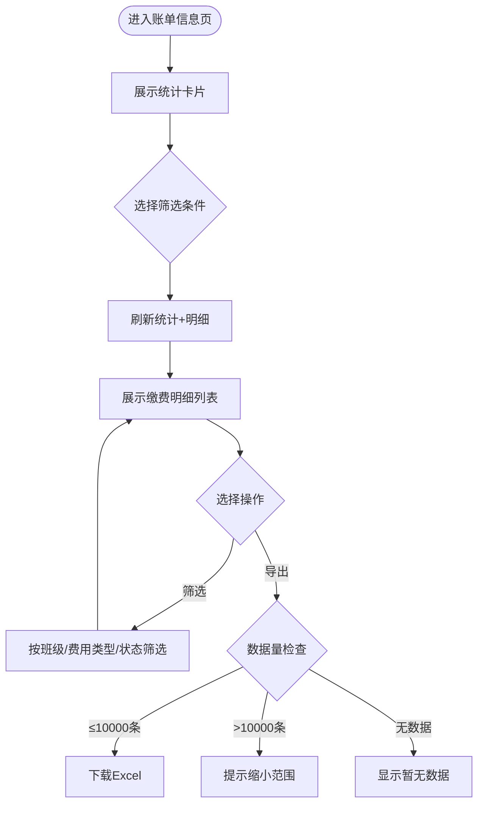

##### 3.3.2.12 园长端 — 开票管理

**（一）功能需求概述**

园长查看家长对应账单的开票情况：已开票/未开票/开票失败，支持筛选和手动重试开票失败记录。

**（二）功能设计**

---

**查询/筛选功能**

| 筛选字段 | 字段类型 | 说明 |
|---------|---------|------|
| 幼儿姓名 | 文本输入框 | 支持模糊搜索 |
| 开票状态 | 下拉选择 | 选项：已开票 / 未开票 / 开票失败 / 全部 |
| 开具时间 | 日期范围 | 格式：YYYY-MM-DD |

---

**列表功能**

| 列名 | 字段类型 | 说明 |
|------|---------|------|
| 幼儿姓名 | 文本 | — |
| 费用类型 | 标签 | 保育费（蓝色）/ 伙食费（橙色） |
| 金额 | 文本 | ¥[金额] |
| 支付状态 | 标签 | 已支付（绿色） |
| 开票状态 | 标签 | 已开票（绿色）/ 未开票（灰色）/ 开票失败（红色） |
| 开具时间 | 文本 | 已开票显示 YYYY-MM-DD HH:mm:ss，未开票显示 "-" |
| 操作 | 按钮 | 开票失败：[手动重试]；其他状态：— |

- 分页默认每页 20 条
- 列表为空时显示：「暂无开票记录」

---

**手动重试**

- 仅「开票失败」记录显示「手动重试」按钮
- 点击后重新调用财务系统开票接口
- 成功：状态更新为「已开票」
- 失败：保持「开票失败」，提示失败原因

---

**异常场景处理**

| 异常场景 | 触发条件 | 系统响应 |
|---------|---------|---------|
| 手动重试开票失败 | 财务系统开票接口异常 | 提示：「开票失败：[失败原因]」，状态保持「开票失败」 |
| 列表加载异常 | 接口超时或网络异常 | 提示：「数据加载失败，请重试」，提供重试按钮 |
| 开票记录不存在 | 支付未完成或记录已删除 | 列表不展示该记录 |

---

**用户操作流程图**

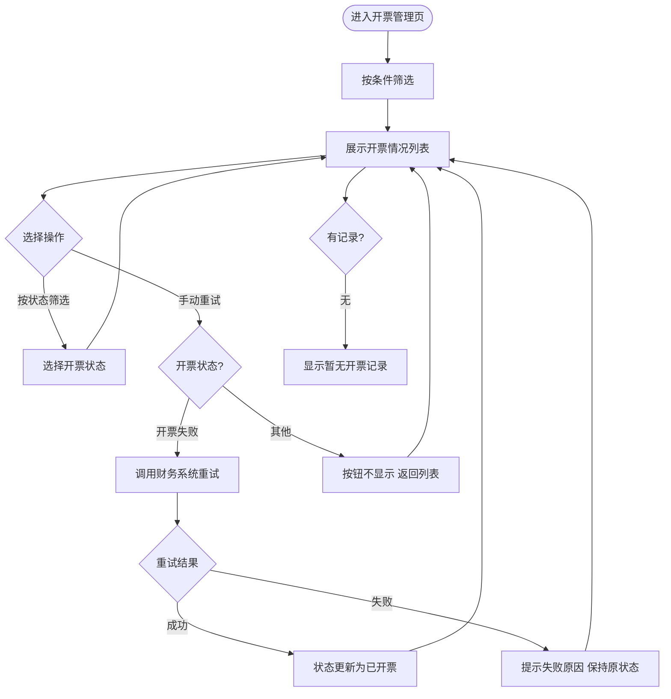

##### 3.3.2.13 园长端 — 配置管理

**（一）功能需求概述**

园长按班级（小班/中班/大班）分别配置保育费和伙食费标准。审核通过后，系统自动按班级套用费用生成账单。保留配置变更历史。

**（二）功能设计**

---

**费用标准配置**

| 字段名称 | 字段类型 | 长度限制 | 是否必填 | 默认值 | 说明 |
|---------|---------|---------|---------|-------|------|
| 班级 | 只读 | — | — | — | 小班 / 中班 / 大班（三行固定） |
| 保育费金额 | 数字输入 | 最大值 999999.99，2 位小数 | 是 | 当前值 | 单位：元，≥0 |
| 伙食费金额 | 数字输入 | 最大值 999999.99，2 位小数 | 是 | 当前值 | 单位：元，≥0 |

- 三个班级同时展示在一个页面，各自可独立修改保存
- 点击「保存」后新费用标准立即生效
- 已生成未支付的账单是否同步更新 [待确认]

---

**历史记录**

| 列名 | 字段类型 | 说明 |
|------|---------|------|
| 班级 | 文本 | 小班 / 中班 / 大班 |
| 修改前保育费 | 文本 | ¥[金额] |
| 修改后保育费 | 文本 | ¥[金额] |
| 修改前伙食费 | 文本 | ¥[金额] |
| 修改后伙食费 | 文本 | ¥[金额] |
| 修改时间 | 文本 | YYYY-MM-DD HH:mm:ss |
| 操作人 | 文本 | 园长 |

- 分页默认每页 20 条

---

**异常场景处理**

| 异常场景 | 触发条件 | 系统响应 |
|---------|---------|---------|
| 金额输入负数或非数字 | 实时输入校验 | 提示：「请输入有效金额」，阻止保存 |
| 两项费用均为 0 | 保育费和伙食费均为 0 | 提示：「该班级保育费和伙食费不能同时为 0」 |

---

**用户操作流程图**

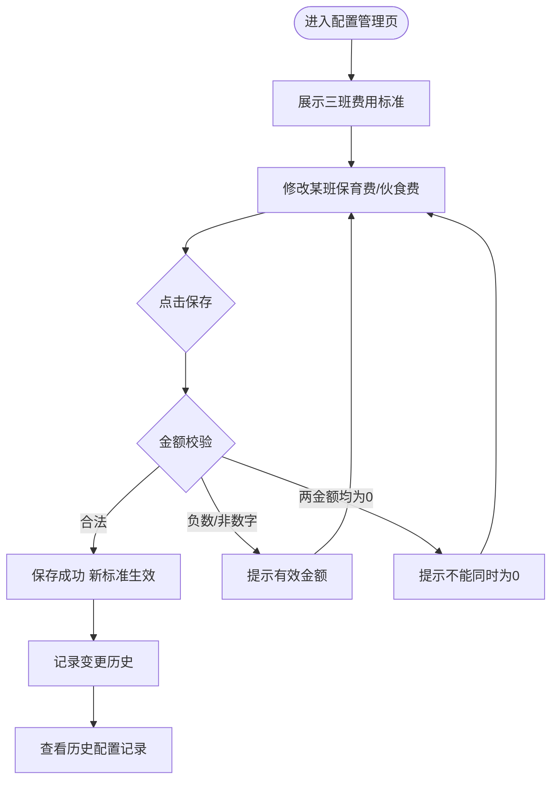

##### 3.3.2.14 园长端 — 第三方对接

**（一）功能需求概述**

对接第三方 PC 端业务系统，实现园长通过第三方系统单点登录（SSO）跳转至本系统管理后台，用户信息互通。

**（二）功能设计**

---

**单点登录**

- 园长在第三方 PC 业务系统登录后，通过链接跳转至本系统管理后台
- 系统校验 SSO Token，验证通过后自动登录，无需再次输入账号密码
- 登录后拥有园长角色全部权限

---

**业务规则**

1. SSO Token 有效期与第三方系统一致
2. 首次 SSO 登录时自动创建园长账号（如不存在）

---

**异常场景处理**

| 异常场景 | 触发条件 | 系统响应 |
|---------|---------|---------|
| SSO Token 过期或无效 | Token 校验失败 | 提示：「登录已过期，请从第三方系统重新登录」，跳转回第三方系统登录页 |
| 园长账号创建失败 | 首次 SSO 登录时自动创建账号异常 | 提示：「账号初始化失败，请联系系统管理员」，不阻塞 SSO 流程（可后续手动创建） |
| 第三方系统不可达 | SSO 跳转来源校验失败 | 提示：「非法访问来源」，拒绝登录 |

---

**用户操作流程图**

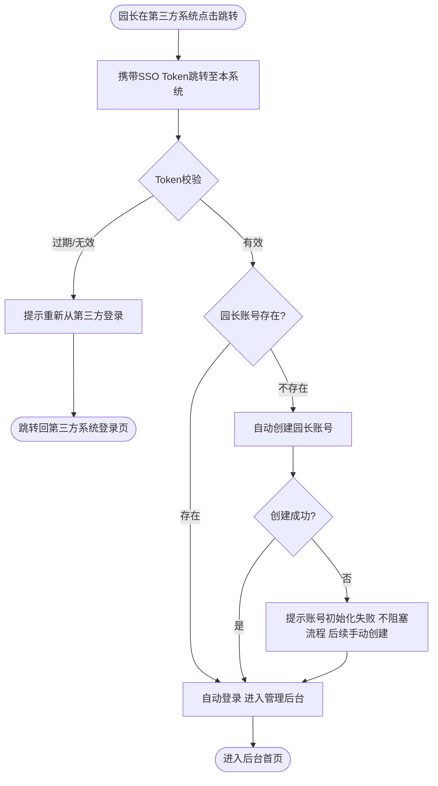

---

### 3.4 非功能需求

#### 3.4.1 性能要求

| 需求项 | 指标 |
|--------|------|
| H5 页面首屏加载 | ≤ 2 秒 |
| 附件上传 | 支持断点续传 |

#### 3.4.2 安全要求

| 需求项 | 说明 |
|--------|------|
| 数据隔离 | 家长仅能查看和管理自己的子女信息 |
| 支付安全 | HTTPS 传输，支付平台签名校验 |
| 敏感信息脱敏 | 手机号等敏感字段列表展示时脱敏 |
| SSO 安全 | SSO Token 校验，防止未授权访问 |

#### 3.4.3 兼容性

| 端 | 环境 | 支持范围 |
|----|------|---------|
| 家长 H5 端 | 苏大 APP WebView | 微信内核（iOS/Android）+ 系统 WebView |
| 园长 PC 端 | 浏览器 | Chrome 最新 2 个版本、Edge 最新 2 个版本 |

#### 3.4.4 系统对接清单

| 对接系统 | 对接内容 | 对接方式 |
|---------|---------|---------|
| 教职工系统 | 获取教职工及子女信息 | API 接口 |
| 支付系统 | 微信/支付宝支付下单与回调 | API 接口 |
| 财务系统 | 电子发票开具、退款执行 | API 接口 |
| 苏大 APP 消息体系 | 业务通知推送 | API 接口（待确认） |
| 第三方 PC 业务系统 | SSO 单点登录 | SSO Token 校验 |
